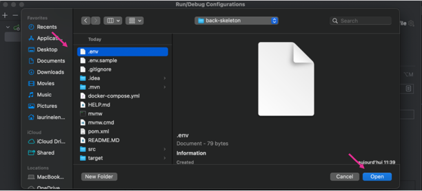

# Your backend API

## Set up 
1. Copie-colle le .env.sample en .env
2. Fait un `docker-compose up`
2. Rajoute le pluggin : https://plugins.jetbrains.com/plugin/7861-envfile
3. 
3. 
3. 

# Schéma UML de la Base de Données

Ce schéma représente la structure de la base de données pour un site d'avis sur les films et les lieux.

## Utilisateurs (users)

| Nom de la colonne | Type      | Description                                     |
|-------------------|-----------|-------------------------------------------------|
| id                | INT       | Clé primaire identifiant de l'utilisateur      |
| first_name        | TEXT      | Prénom de l'utilisateur                        |
| last_name         | TEXT      | Nom de famille de l'utilisateur                |
| birthdate         | DATE      | Date de naissance de l'utilisateur             |
| username          | VARCHAR   | Nom d'utilisateur unique                       |
| password          | VARCHAR   | Mot de passe de l'utilisateur                  |
| image             | BYTEA     | Image de profil de l'utilisateur (optionnel)    |
| created_at        | TIMESTAMP | Date de création de l'utilisateur              |

## Films (movies)

| Nom de la colonne | Type      | Description                                     |
|-------------------|-----------|-------------------------------------------------|
| id                | INT       | Clé primaire identifiant du film                |
| title             | VARCHAR   | Titre du film                                   |
| director          | VARCHAR   | Réalisateur du film                            |
| release_date      | DATE      | Date de sortie du film                         |
| synopsis          | TEXT      | Synopsis du film                                |
| poster_url        | VARCHAR   | URL de l'affiche du film                       |
| created_at        | TIMESTAMP | Date de création du film                       |

## Types de Lieux (place_types)

| Nom de la colonne | Type      | Description                                     |
|-------------------|-----------|-------------------------------------------------|
| id                | INT       | Clé primaire identifiant du type de lieu        |
| name              | VARCHAR   | Nom du type de lieu                             |

## Lieux (places)

| Nom de la colonne | Type      | Description                                     |
|-------------------|-----------|-------------------------------------------------|
| id                | INT       | Clé primaire identifiant du lieu                |
| title             | VARCHAR   | Titre ou nom du lieu                            |
| type_id           | INT       | ID du type de lieu (référence à place_types)    |
| address           | VARCHAR   | Adresse du lieu                                 |
| opening_hours     | VARCHAR   | Horaires d'ouverture du lieu                   |
| created_at        | TIMESTAMP | Date de création du lieu                       |

## Avis (reviews)

| Nom de la colonne | Type      | Description                                     |
|-------------------|-----------|-------------------------------------------------|
| id                | INT       | Clé primaire identifiant de l'avis              |
| user_id           | INT       | ID de l'utilisateur ayant laissé l'avis        |
| entity_id         | INT       | ID de l'entité (film ou lieu) associée à l'avis |
| entity_type       | VARCHAR   | Type de l'entité (peut être 'movie' ou 'place')|
| rating            | INT       | Note attribuée à l'avis                         |
| summary           | TEXT      | Résumé de l'avis                                |
| review            | TEXT      | Contenu détaillé de l'avis                      |
| created_at        | TIMESTAMP | Date de création de l'avis                      |
